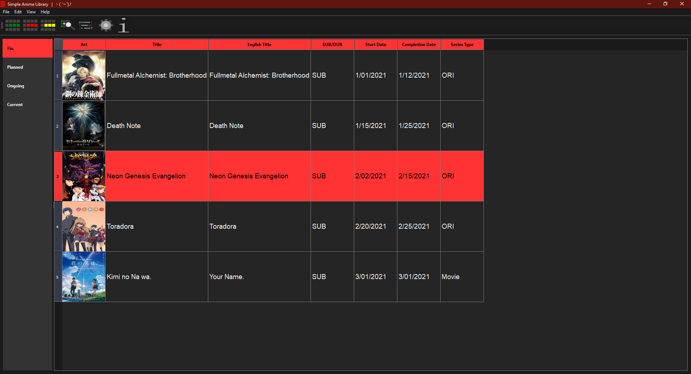
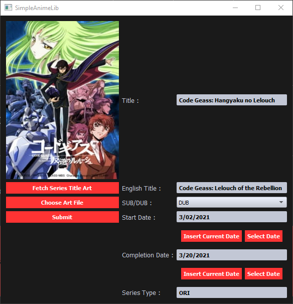

# Simple Anime Library

Open-Source desktop application for managing your own local anime list.

Built with PyQt5

Currently in alpha (unstable)

# Features

- Simple design and functionality. No bells and whistles.
- All data stored locally.
- No telemetry. Your data belongs to you.
- No Accounts required
- Customize the style of the app however you like using qss.

# Screenshots

 

# Credits

Beautiful qss themes from Qss-Stock <3 [check them out](https://qss-stock.devsecstudio.com/).

Jikan REST API [Jikan](https://github.com/jikan-me/jikan-rest) , [apiary](https://jikan.docs.apiary.io/#)

# Liscense

MIT Liscense
